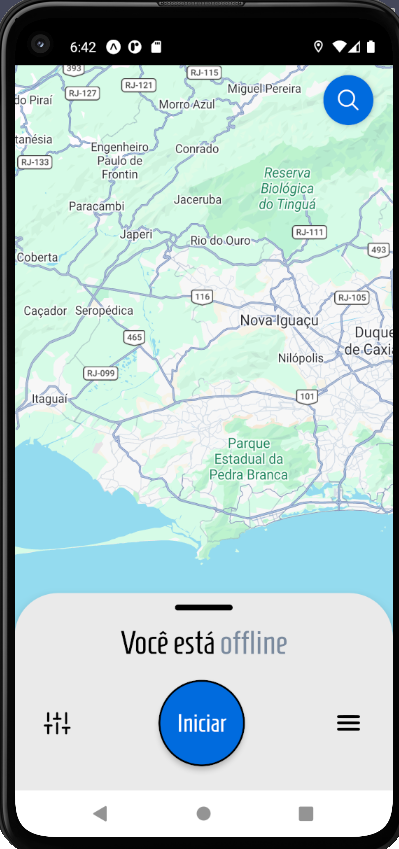
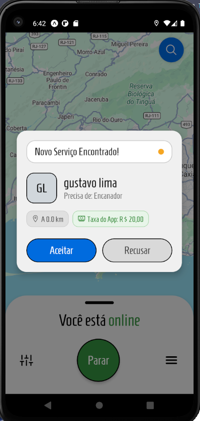
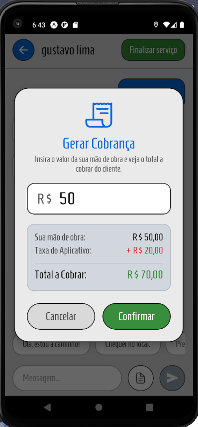
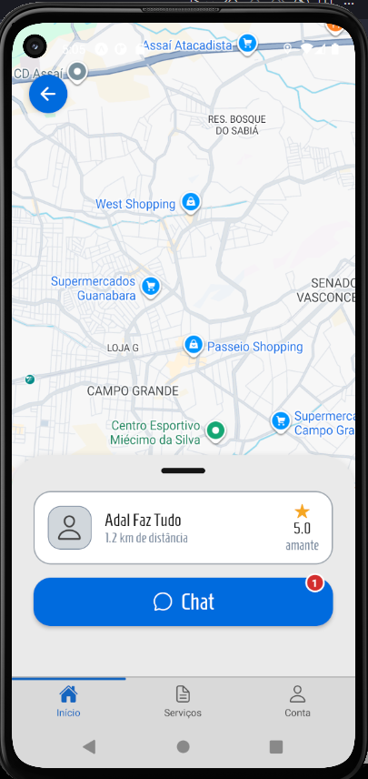

# 📱 ResolveAI

<p align="center">
  
</p>

<p align="center">


</p>

---

# 📖 Sobre o projeto

O **ResolveAI** é um aplicativo mobile desenvolvido em grupo como projeto acadêmico, inspirado na experiência de plataformas como Uber, mas voltado para contratação de prestadores de serviços.

A aplicação conecta clientes e profissionais através da geolocalização em tempo real, permitindo que clientes encontrem profissionais próximos para diversos tipos de serviços.

Após a aceitação de uma solicitação, cliente e profissional passam a compartilhar um chat exclusivo para comunicação durante todo o atendimento, podendo acompanhar o serviço até sua conclusão e realizar avaliações posteriormente.

---

# 🚀 Principais funcionalidades

## 👤 Cliente

- Cadastro e autenticação
- Buscar profissionais próximos
- Visualização em mapa
- Solicitação de serviços
- Chat em tempo real com o profissional
- Histórico de serviços
- Avaliações e comentários

---

## 👨‍🔧 Profissional

- Cadastro de múltiplas profissões
- Configuração do raio de atuação
- Recebimento de solicitações em tempo real
- Aceitar ou recusar serviços
- Atualização da localização
- Chat em tempo real com o cliente
- Geração da cobrança
- Recebimento de avaliações
- Comentários fixados no perfil

---

# 📸 Demonstração

## Tela inicial do profissional



---

## Novo serviço encontrado em tempo real



---

## Chat entre cliente e profissional


---

## Geração da cobrança



---

## Busca de profissionais



---

# 🏗️ Arquitetura

O aplicativo foi desenvolvido utilizando uma arquitetura baseada em Backend as a Service (BaaS), utilizando o Supabase como principal serviço backend.

Fluxo da aplicação:

```text
Cliente
      │
      ▼
Solicita Serviço
      │
      ▼
Supabase Realtime
      │
      ▼
Profissional recebe solicitação
      │
      ▼
Aceita o serviço
      │
      ▼
Chat em tempo real
      │
      ▼
Conclusão do serviço
      │
      ▼
Avaliação
```

---

# 🛠️ Tecnologias Utilizadas

| Tecnologia | Finalidade |
|------------|------------|
| React Native | Desenvolvimento Mobile |
| Expo | Ambiente de desenvolvimento |
| JavaScript | Linguagem principal |
| React Context API | Gerenciamento global de estado |
| Supabase | Backend |
| PostgreSQL | Banco de Dados |
| Google Maps API | Mapas |
| Expo Location | Geolocalização |
| Supabase Authentication | Login |
| Supabase Realtime | Atualizações em tempo real |
| Supabase Storage | Armazenamento de imagens |
| Row Level Security | Segurança do banco |

---

# ⚙️ Recursos Técnicos

✔️ Autenticação de usuários

✔️ Controle de acesso por tipo de usuário

✔️ Geolocalização em tempo real

✔️ Busca de profissionais por proximidade

✔️ Comunicação em tempo real

✔️ Chat entre cliente e profissional

✔️ Atualização automática dos serviços

✔️ Sistema de avaliações

✔️ Upload de imagens

✔️ Banco de dados PostgreSQL

✔️ Controle de permissões com RLS

---

# 📲 Teste o aplicativo

O projeto utiliza variáveis de ambiente (`.env`) contendo credenciais do Supabase e da Google Maps API. Por isso, ele não pode ser executado diretamente após o clone do repositório.

Para facilitar a demonstração, disponibilizei uma versão APK.

➡️ **[Download do APK](https://github.com/Juii-Cesar/App_mobile-ResolveAi/releases/latest)**

---

# 📚 Aprendizados

Durante o desenvolvimento deste projeto foi possível aprofundar conhecimentos em:

- React Native
- Expo
- Context API
- Arquitetura Mobile
- PostgreSQL
- Modelagem de banco de dados
- Supabase Authentication
- Supabase Realtime
- Buckets
- Row Level Security
- Google Maps API
- Geolocalização
- Comunicação em tempo real
- Desenvolvimento colaborativo utilizando Git

---

# 👨‍💻 Minha contribuição

Embora o projeto tenha sido desenvolvido em grupo, participei ativamente do desenvolvimento das principais funcionalidades da aplicação, incluindo:

- Integração com Supabase
- Estruturação do banco PostgreSQL
- Sistema de autenticação
- Sistema de chat em tempo real
- Integração com Google Maps
- Geolocalização dos usuários
- Implementação do Supabase Realtime
- Upload de imagens utilizando Storage Buckets
- Implementação das políticas de segurança (Row Level Security)
- Desenvolvimento de telas em React Native

---

# 💼 Objetivo

Este projeto foi desenvolvido como trabalho acadêmico com o objetivo de aplicar conceitos de desenvolvimento mobile, banco de dados, APIs, autenticação, comunicação em tempo real e arquitetura moderna utilizando Backend as a Service.

Além do ambiente acadêmico, o projeto faz parte do meu portfólio pessoal para demonstrar minhas habilidades em desenvolvimento Full Stack Mobile.

---

## 👤 Autor

**Júlio César**

[GitHub](https://github.com/Juii-Cesar)

[LinkedIn](https://www.linkedin.com/in/j%C3%BAlio-c%C3%A9sar-correa-alves-dev/)
